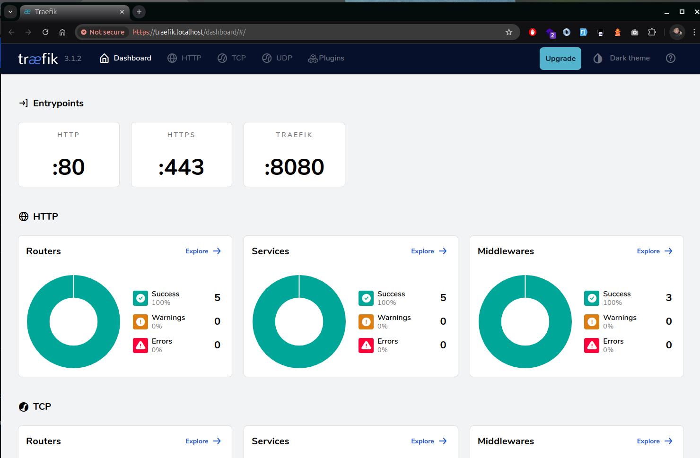
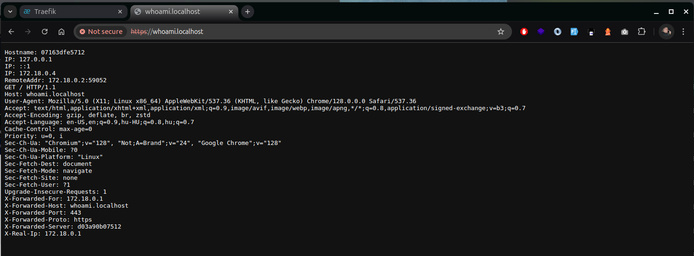

# Traeefik v3 for local development

## Prerequisits

git
docker
docker-compose

## Usage
```shell
git clone git@github.com:Alphaws/traeefik.git
cd traefik
bin/up
```
test: 
- https://traefik.localhost



- https://whoami.localhost


